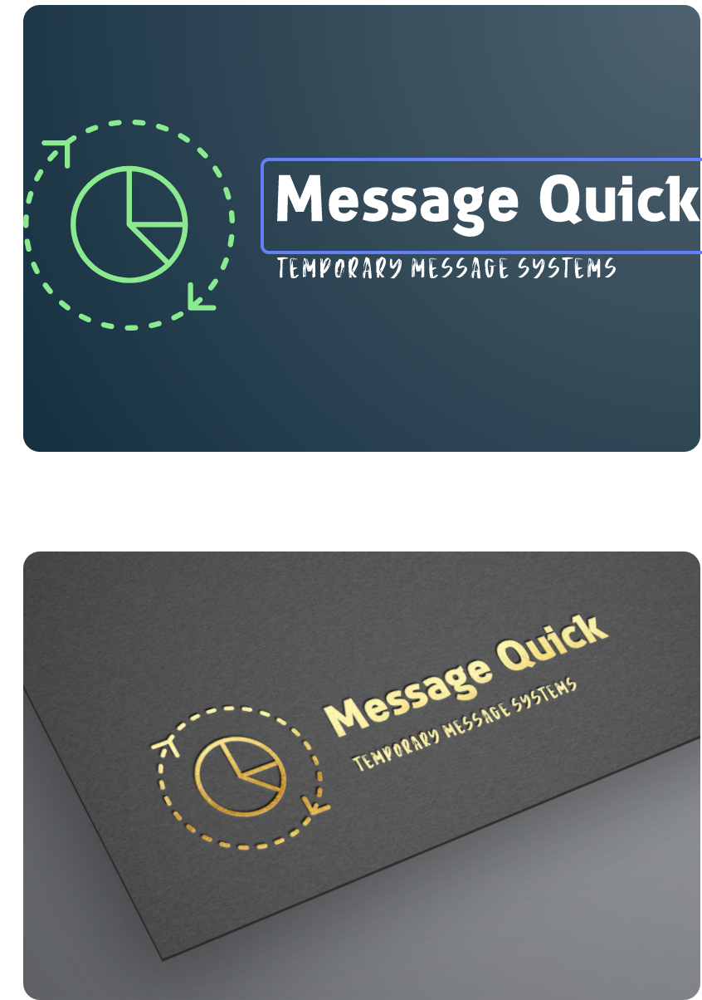
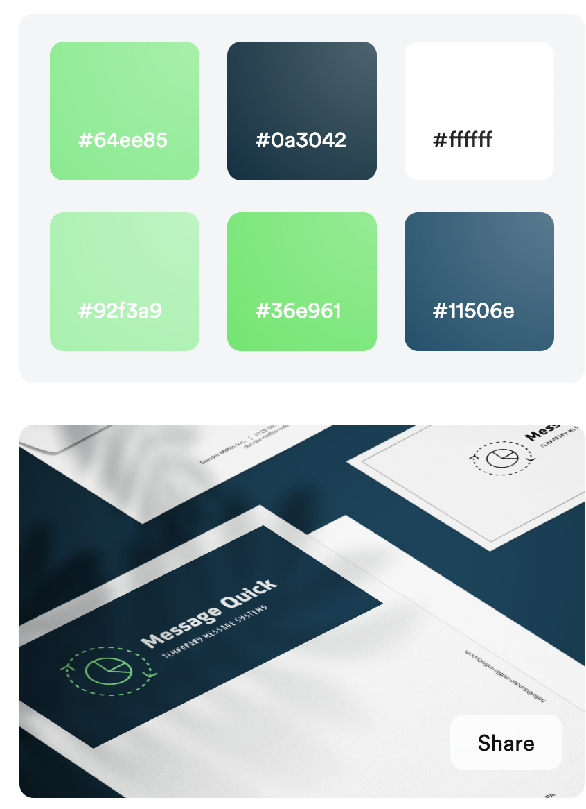

# MessagingBoard
NodeJs, Express and MongoDB powered project


## Installed packages:

* express generator with ejs 
    ```
    express express-locallibrary-tutorial --view=ejs
    ```
* nodemon for development without restaring server
    ```
    install nodemon
    ```
* add scrips for development 
    ```javascript
    "devstart":
     "nodemon ./bin/www",

    "serverstart": 
    "DEBUG=express-locallibrary-tutorial:* npm run devstart"
    ```
---
## Published on heroku
<a href="https://pure-mountain-02423.herokuapp.com/" target="_blank" rel="noopener noreferrer">Heroku Link</a>

---
<br>
<br>

### This branch is here to try implement color pallet and visual estetics

visual source 


